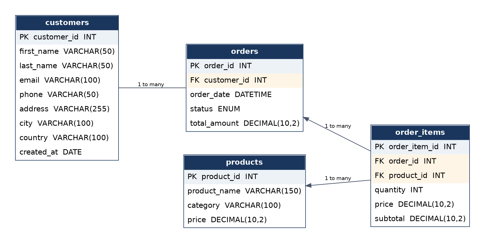
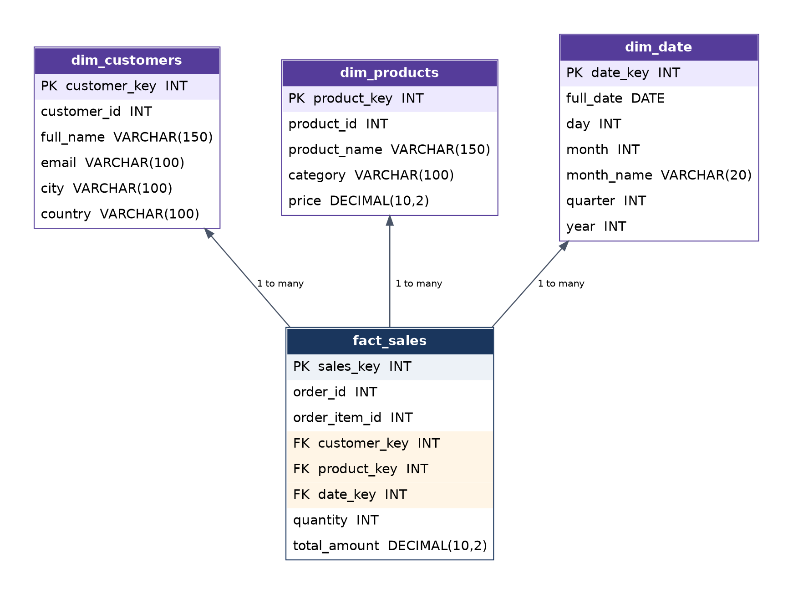
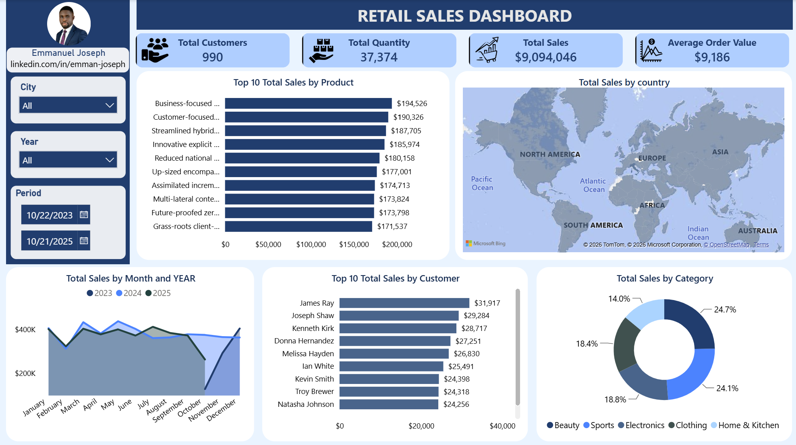

# Retail Sales Analysis — OLTP → OLAP → Power BI

An end-to-end data pipeline that takes normalized transactional retail data through an ETL process into a dimensional (star schema) data warehouse, then surfaces it in a Power BI dashboard.

The project covers three stages:

1. **OLTP** — a normalized (3NF) MySQL schema for transactional data entry.
2. **ETL / OLAP** — SQL-based transformation of the OLTP schema into a star schema (fact + dimension tables) for analytics.
3. **Power BI** — a connected dashboard with KPIs, trend analysis, and segment breakdowns built on top of the OLAP layer.

---

## Project Structure

```
├── README.md
├── datasets/
│    ├── customers.csv
│    ├── products.csv
│    ├── orders.csv
│    ├── order_items.csv
├── docs/
│    ├── 01_oltp_schema.md          # OLTP DDL, table definitions, load scripts
│    ├── 02_etl_olap_schema.md      # OLAP DDL, ETL transformation SQL
│    ├── 03_powerbi_dashboard.md    # Power BI model, DAX measures, visuals
│    └── PROJECT_REPORT.docx        # Full project report
├── erd/
│    ├── retail_sales_oltp_erd.png               # OLTP entity-relationship diagram
│    └── retail_sales_olap_erd.png               # OLAP star schema diagram
├── dashboard/
│    └── powerbi_dashboard.png        # Dashboard screenshot
│    └── retail_sales_dashboard.pbix
├── sql/
     └── retail_sales_analysis_oltp.sql
     └── retail_sales_analysis_etl_olap.sql
```

---

## 1. OLTP Layer — `retail_oltp`

A normalized transactional schema with four tables: `customers`, `products`, `orders`, `order_items`. Referential integrity is enforced with foreign keys (`orders.customer_id → customers`, `order_items.order_id → orders`, `order_items.product_id → products`).



Full DDL and `LOAD DATA INFILE` scripts are in [`docs/01_oltp_schema.md`](docs/01_oltp_schema.md).

## 2. OLAP Layer — `retail_olap`

The OLTP tables are transformed into a star schema using SQL `INSERT ... SELECT` statements: three dimension tables (`dim_customers`, `dim_products`, `dim_date`) and one fact table (`fact_sales`) that references them by surrogate keys.



Full ETL SQL is in [`docs/02_etl_olap_schema.md`](docs/02_etl_olap_schema.md).

## 3. Power BI Dashboard

Power BI Desktop connects directly to `retail_olap` via a MySQL connector. The model is set up as a star schema with single-direction, one-to-many relationships from each dimension to `fact_sales`.



**KPI cards:** Total Customers, Total Quantity Sold, Total Sales, Average Order Value
**Visuals:** Top 10 products by sales, sales by country (map), monthly/yearly sales trend, top 10 customers, sales by category (donut)
**Filters:** City, Year, and a date-range slicer (Period)

DAX measures and visual configuration are documented in [`docs/03_powerbi_dashboard.md`](docs/03_powerbi_dashboard.md).

---

## Tech Stack

| Layer | Tool |
|---|---|
| Database | MySQL |
| ETL | SQL (`INSERT ... SELECT`) |
| Visualization | Power BI Desktop |
| Diagrams | Graphviz |

## How to Reproduce

1. Run the DDL in `docs/01_oltp_schema.md` to create and populate `retail_oltp` from source CSVs.
2. Run the DDL and ETL statements in `docs/02_etl_olap_schema.md` to build `retail_olap` from `retail_oltp`.
3. In Power BI Desktop, connect to `retail_olap` via **Get Data → MySQL database**, load the four tables, and set up the relationships as shown in the OLAP diagram above.
4. Add the DAX measures listed in `docs/03_powerbi_dashboard.md` and build the visuals.

## Notes and Known Limitations

- The **Average Order Value** measure is defined in this project as `Total Sales / Total Customers` (i.e., average revenue per customer), not `Total Sales / number of orders`, which is the more conventional definition of AOV. This is noted here so the metric isn't misread — see `docs/03_powerbi_dashboard.md` for detail.
- `dim_date` is populated only with dates that appear in the `orders` table, not a full continuous calendar; date gaps outside the order history won't appear in `dim_date`.
- The pipeline is a batch/manual process (run on demand), not a scheduled or incremental load.

## Author

Emmanuel Joseph | [LinkedIn](https://www.linkedin.com/in/emman-joseph) | [GitHub link](https://github.com/Joemy2392/project/tree/main/retail_sales_analysis).
